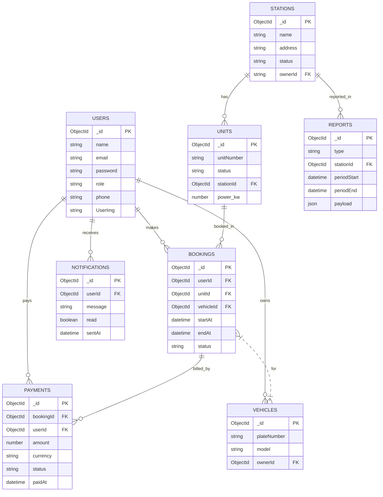
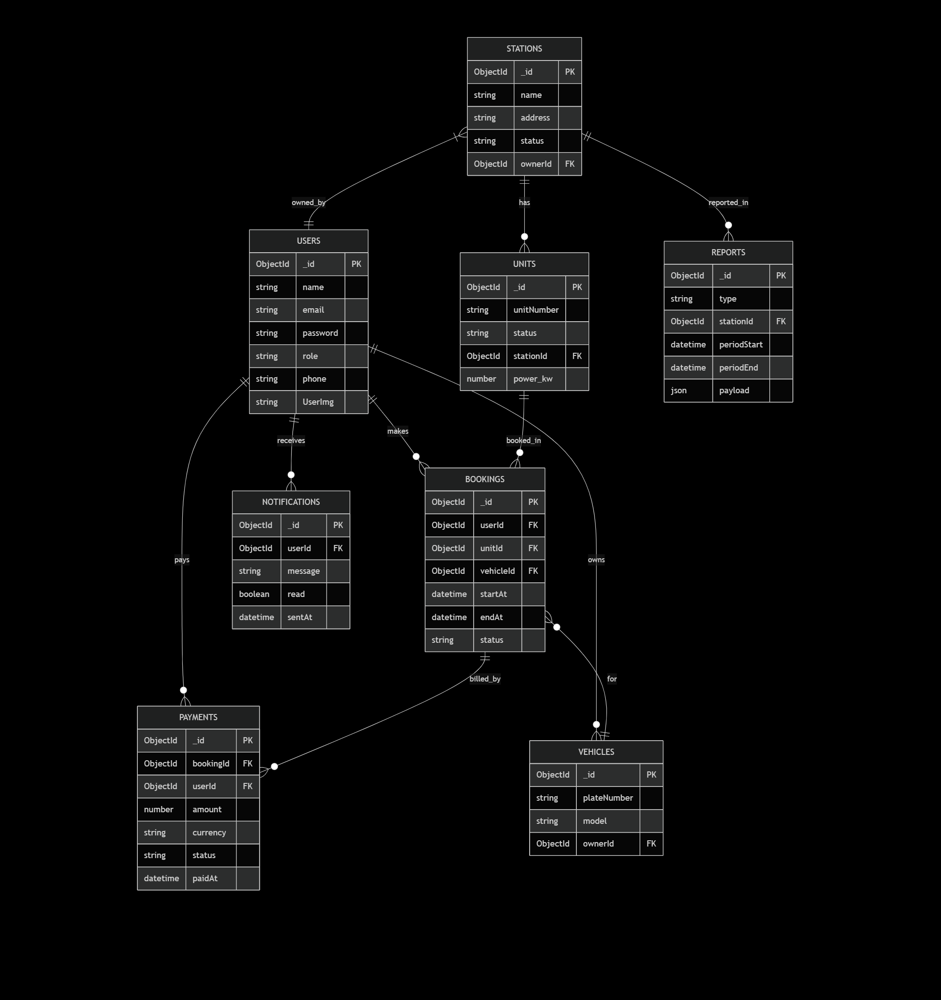

# ChargeNet 🔌

ChargeNet is a comprehensive Electric Vehicle (EV) charging station management system that enables drivers to find, book, and pay for charging sessions while allowing station owners to manage their charging infrastructure efficiently.

## Features ⚡

- **User Management**
  - Multi-role system (Driver, Owner, SuperAdmin)
  - Secure authentication and authorization
  - Profile management with user images

- **Station Management**
  - Real-time station status monitoring
  - Unit management and maintenance tracking
  - Comprehensive station details and availability

- **Booking System**
  - Automated scheduling system
  - Real-time booking management
  - Charge session reminders

- **Payment Integration**
  - Secure payment processing through Paymob
  - Payment history tracking
  - Automated payment handling

- **Reporting**
  - Daily and monthly automated reports
  - Custom report generation
  - Performance analytics

## Technology Stack

- **Backend Framework:** Node.js with Express.js
- **Database:** MongoDB with Mongoose ODM
- **Authentication:** JWT (JSON Web Tokens) with bcrypt for password hashing
- **Task Scheduling:** Agenda.js
- **Email Service:** Nodemailer
- **HTTP Client:** Axios for API integrations
- **Logging:** Morgan for HTTP request logging, Winston for application logging
- **Containerization:** Docker and Docker Compose
- **API Security:**
  - Helmet for HTTP headers security
  - Express Rate Limit for API rate limiting
  - CORS enabled
  - Request validation with Joi
- **Development Tools:**
  - ESLint for code linting
  - Prettier for code formatting
  - Nodemon for development auto-reload
  - Postman for API testing and documentation

## Project Structure 📁

```
src/
├── app.js                  # Express app configuration
├── server.js              # Server entry point
├── config/               # Configuration files
│   ├── agendaConfig.js   # Job scheduler config
│   ├── db.js            # Database connection
│   └── logger.js        # Logging configuration
├── controllers/         # Request handlers
│   ├── authControllers.js
│   ├── BookingController.js
│   ├── PaymentControllers.js
│   ├── ReportsController.js
│   ├── StationsController.js
│   ├── UnitsController.js
│   ├── UsersControllers.js
│   └── VehiclesControllers.js
├── dataAccess/         # Data access layer
│   ├── Booking.dataAccess.js
│   ├── payment.dataAcess.js
│   ├── Reports.dataAccess.js
│   ├── satation.dataAccess.js
│   ├── unit.dataAccess.js
│   ├── user.dataAccess.js
│   └── Vehicle.dataAccess.js
├── jobs/              # Scheduled jobs
│   ├── autoScheduler.js
│   ├── bookingAuto.js
│   ├── chargeReminder.js
│   ├── dailyReport.job.js
│   ├── monthlyReport.job.js
│   └── various automation jobs
├── middleware/        # Express middleware
│   ├── auth.js       # Authentication middleware
│   ├── error.js      # Error handling
│   └── validateMiddleware.js
├── models/           # Mongoose models
│   ├── BookingModels.js
│   ├── NotificationsModels.js
│   ├── PaymentModels.js
│   ├── StationsModels.js
│   ├── UnitsModels.js
│   ├── UsersModels.js
│   └── VehiclesModels.js
├── routes/           # API routes
│   ├── auth.js
│   ├── Booking.js
│   ├── index.js
│   ├── Payment.js
│   ├── Reports.js
│   ├── Stations.js
│   ├── Units.js
│   ├── Users.js
│   └── Vehicles.js
├── services/         # Business logic
│   ├── authService.js
│   ├── BookingServices.js
│   ├── paymentService.js
│   ├── ReportsServices.js
│   ├── StationService.js
│   ├── UnitServices.js
│   ├── UserServices.js
│   └── VehicleService.js
├── utils/           # Utility functions
│   ├── Agenda.js
│   ├── apiError.js
│   ├── jwt.js
│   ├── paymob.js
│   └── sendEmail.js
└── validators/      # Request validators
    ├── BookingValiations.js
    ├── PaymentValidations.js
    ├── StationsValidations.js
    ├── UnitsValidations.js
    ├── UserValidations.js
    └── VehiclesValidations.js

```

## ERD (Entity-Relationship Diagram)

A conceptual ERD for the ChargeNet project is included in `docs/ERD.mmd` (Mermaid format). You can view and edit the source there or render it with the Mermaid Live Editor.

Quick inline Mermaid source (also available in `docs/ERD.mmd`):



 
```bash
# Install mermaid-cli (optional)
npm i -g @mermaid-js/mermaid-cli

# Export PNG
mmdc -i docs/ERD.mmd -o docs/ERD.png
```

### Rendered ERD  



## Prerequisites 📋

- Node.js (v14 or higher)
- MongoDB
- npm or yarn package manager
- Docker and Docker Compose (optional, for containerized deployment)
- Postman (for testing APIs and accessing the collection)

## Installation

1. Clone the repository:

   ```bash
   git clone https://github.com/abdallah4321/ChargeNet.git
   ```

2. Install dependencies:

   ```bash
   npm install
   ```

3. Create a .env file in the root directory with the following variables:

   ```env
   PORT=3000
   MONGODB_URI=your_mongodb_connection_string
   JWT_SECRET=your_jwt_secret
   EMAIL_SERVICE=your_email_service
   EMAIL_USER=your_email_username
   EMAIL_PASS=your_email_password
   PAYMOB_API_KEY=your_paymob_api_key
   ```

4. Start the development server:

   ```bash
   # Using npm
   npm run dev

   # Using Docker
   docker-compose up
   ```

5. Import the Postman Collection:
   - Open Postman
   - Click on "Import"
   - Select the `ChargeNet.postman_collection.json` file from the project root
   - You now have access to all API endpoints for testing

## Scripts

- `npm run dev`: Start the development server with hot-reload
- `npm start`: Start the production server
- `npm run seed`: Seed the database with initial data
- `npm run lint`: Run ESLint
- `npm run lint:fix`: Fix ESLint issues
- `npm run format`: Format code with Prettier

## API Documentation 📚

The API is organized around REST principles. It accepts JSON-encoded request bodies, returns JSON-encoded responses, and uses standard HTTP response codes.

### Base URL

```
http://localhost:3000/api/v1
```

### Available Endpoints

#### Authentication

- `POST /auth/register` - Register a new user
- `POST /auth/login` - Login user
- `GET /auth/me` - Get current user profile

#### Users

- `GET /users` - Get all users
- `GET /users/:id` - Get user by ID
- `PUT /users/:id` - Update user
- `DELETE /users/:id` - Delete user
- `PUT /users/ban/:id` - Ban/unban user

#### Stations

- `POST /stations` - Create new station
- `GET /stations` - Get all stations
- `GET /stations/:id` - Get station by ID
- `PUT /stations/:id` - Update station
- `DELETE /stations/:id` - Delete station

#### Units

- `POST /units` - Create new charging unit
- `GET /units` - Get all units
- `GET /units/:id` - Get unit by ID
- `PUT /units/:id` - Update unit
- `DELETE /units/:id` - Delete unit

#### Bookings

- `POST /bookings` - Create new booking
- `GET /bookings` - Get all bookings
- `GET /bookings/:id` - Get booking by ID
- `PUT /bookings/:id` - Update booking
- `DELETE /bookings/:id` - Cancel booking

#### Vehicles

- `POST /vehicles` - Add new vehicle
- `GET /vehicles` - Get all vehicles
- `GET /vehicles/:id` - Get vehicle by ID
- `PUT /vehicles/:id` - Update vehicle
- `DELETE /vehicles/:id` - Delete vehicle

#### Payments

- `POST /payments/create` - Create payment intent
- `POST /payments/process` - Process payment
- `GET /payments/history` - Get payment history

#### Reports

- `GET /reports/daily` - Get daily reports
- `GET /reports/monthly` - Get monthly reports
- `GET /reports/custom` - Get custom date range reports

### Postman Collection

You can find the complete Postman collection with all endpoints, request/response examples, and environment variables in the file: `ChargeNet.postman_collection.json`.

To use the collection:

1. Import the collection into Postman:

   ```bash
   # Collection Location
   c:\Users\hp\Downloads\ChargeNet.postman_collection.json
   ```

2. Set up environment variables:
   - `BASE_URL`: Your API base URL (default: http://localhost:3000/api/v1)
   - `TOKEN`: Your authentication token (automatically set after login)

3. Use the organized folders to find and test endpoints:
   - Each request includes necessary headers
   - Request body examples are provided
   - Response examples and status codes are documented
   - Pre-request scripts handle auth token management

## Contributing

1. Fork the repository
2. Create your feature branch (`git checkout -b feature/AmazingFeature`)
3. Commit your changes (`git commit -m 'Add some AmazingFeature'`)
4. Push to the branch (`git push origin feature/AmazingFeature`)
5. Open a Pull Request

## License

This project is licensed under the ISC License - see the LICENSE file for details.

## Support

For support, email support@chargenet.com or join our Slack channel.

---

by Eng/Abdallah ramadan salem
